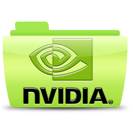

# Eric Zang's Blog

## Table of Contents

* ### 1. Linux Kernel and Driver

* #### 1.1. Linux Kernel Generic Topic

* [The reason of avoiding floating point usage in Linux kernel](./post/linux-kernel/generic/no-floating-point-kernel.md)
* [Basic module knowledge on Linux kernel](./post/linux-kernel/generic/linux-module-basic.md)

* #### 1.2. Lontium lt6911uxc V4l2 Driver

* ### 2. Nvidia Jetson

* #### 2.1. Nvidia Jetson Generic 
* [Update /etc/apt/sources.list for Jeston Nano](./post/nvidia/cuda/sources.list-update.md)
* #### 2.2. Nvidia Jetson cuda

* [Running OpenCV on Nvidia Jetson Nano with HW acceleration](./post/nvidia/cuda/opencv-nano.md)

* #### 2.3. Nvidia cuda

* [How to upgrade cuda toolkit on system76 laptop](./post/nvidia/cuda/cuda-toolkit-system76.md)

* #### 2.3. Nvidia Jetson Multimeida 
* [How to play video with hardware accelerate on Nano](./post/nvidia/multimedia-api/video-hw-codec.md)

* ### 3. OpenCV
* [How to install OpenCV 4 with CUDA in ubuntu22.04](./post/opencv/opencv-cuda.md)
* ### 4. STM32F4

