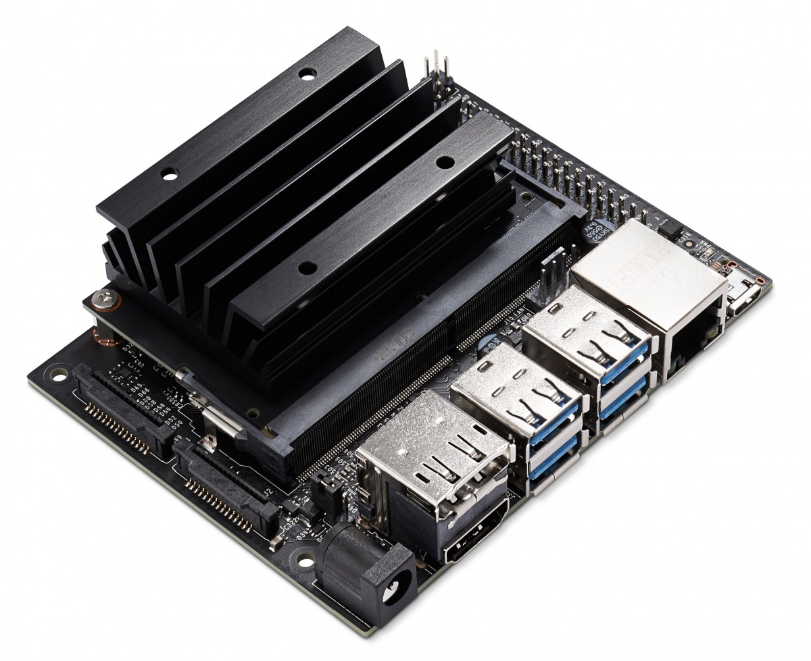

# Eric Zang's Blog

## Table of Contents

1 Nvidia Jetson

1.1 Nvidia Jetson cuda

1.1.1 [Running OpenCV on Nvidia Jetson Nano with HW acceleration](https://github.com/HuiyuanZang/HuiyuanZang.github.io/blob/develop/post/nvidia/cuda/openvc-nano.md)
1.1.2 [Update /etc/apt/sources.list for Jeston Nano](./post/nvidia/cuda/sources.list-update.md)
