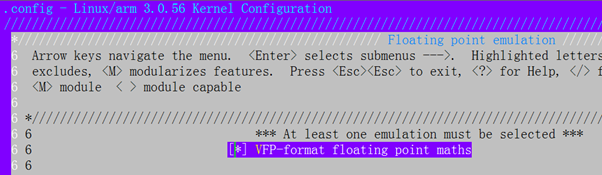
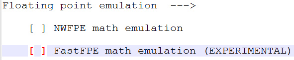

<!-- vscode-markdown-toc -->
# The reason of avoiding floating point usage in Linux kernel

##  1. <a name='table-of-contents'></a>Table of Contents

* 2. [About](#about)
* 3. [Scenario 1](#scenario-1)
* 4. [Scenario 2](#scenario-2)
* 5. [Scenario 3](#scenario-3)
* 6. [Reference](#reference)

##  2. <a name='about'></a>About
Most modern CPUs support floating-point unit FPU, which is placed outside the processor core as a separate coprocessor. But for embedded processors, floating-point operations are rarely used, and some embedded processors remove floating-point coprocessors.  

Additionally, the toolchain is another factor of impacting of how to use floating point. Some toolchains only provide soft FP option, equivalent to -mfloat-abi=soft, so that the code cannot be compiled as FPU instructions even though the processor actives FPU. 

Looking the following three Scenarios. 

| Component Name  | Processor with FPU  |  Processor without FPU |
| :------------: |:---------------:| :-----:|
| Toolchains with hardFP option   | Scenario 1 | NOT POSSIBLE |
| Toolchains with SofeFP option     | Scenario 2       |   Scenario 3 |

##  3. <a name='scenario-1'></a>Scenario 1
For Processor with FPU, check if Linux kernel is complied with hard FP options, you can go arch/xxx/Makefile and find if there is ‘-msoft-float’ OR ‘-mhard-float’ option. However, in some architecture such as ARM64, the default option in the Makefile is -mgeneral-regs-only. There are no options like ‘-msoft-float’ OR ‘-mhard-float’.  Compiling kernel to a hard floating point means that the processor's floating-point instructions compute floating points. 

To compile kernel with FPU support in i386 architecture, go to arch/xxx/Makefile, add option ‘-mhard-float’,then recompile kernel.  In the kernel code or driver, you can put floating point code between kernel_fpu_begin and kernel_fpu_end, e.g.  
``` C

                 kernel_fpu_begin  

                    …………………//floating point calculation 

                 kernel_fpu_end  
```

The reason why calling kernel_fpu_begin and kernel_fpu_end is because whenever a process-switch occurs, the kernel must save the state of the FPU, so that one user-space process doesn't end up with FPU registers from another user-space process. If you want to use floats inside the kernel, then the kernel would have to save the FPU state not only for all user-processes, but also for inside-the-kernel entities that use floats.[1]  
 

To compile kernel with FPU support in arm architecture, go to arch/xxx/Makefile, add option ‘-mhard-float’,then recompile kernel. Unlike kernel_fpu_begin and kernel_fpu_end in i386 architecture, I didn’t find any them supported in arm. When you compile your driver, use options -mfloat-abi=softfp or -mfloat-abi=hard. But chose VFP the kernel configures when config kernel, such as:  




After disassembly an ELF file where there is floating code operation, it looks like the following example:  


``` C
Float x, a 

x = (a-1)/(a+1);  

assembly： 

84b0:    ed1b6b0d     vldr    d6, [fp, #-52]    ; 0xffffffcc 

84b4:    ed9f7b33     vldr    d7, [pc, #204]    ; 8588 <ln+0xf0> 

84b8:    ee365b47     vsub.f64    d5, d6, d7 

84bc:    ed1b6b0d     vldr    d6, [fp, #-52]    ; 0xffffffcc 

84c0:    ed9f7b30     vldr    d7, [pc, #192]    ; 8588 <ln+0xf0> 

84c4:    ee366b07     vadd.f64    d6, d6, d7 

84c8:    ee857b06     vdiv.f64    d7, d5, d6 
```

To compile kernel with FPU support in arm64 architecture, remove option -mgeneral-regs-only or -mno-implicit-float under arch/xxx/Makefile. You don’t need to choose VFP or floating emulation for arm64 since arm64 must support FPU as default. When you compile your driver, use options -mfloat-abi=softfp or -mfloat-abi=hard. 


NOTE: as far as I know there is no functions like kernel_fpu_begin and kernel_fpu_end to store fpu state and related registers either in arm or arm64. So, it is quite likely to mess up user land fpu state.  

In short, don’t use floating point in your driver code in this scenario, it is risky. 

 


##  4. <a name='scenario-2'></a>Scenario 2

Either compiling kernel with option ‘-msoft-float’ ‘-mgeneral-regs-only’ or compiling driver or user land app with option ‘mfloat-abi=soft’, the machine instructions generated by compiler will be functions invocation rather than floating instructions, such as: 
``` C

Float x, a 

x = (a-1)/(a+1);  

assembly： 

    84c8:       e3a0300f        mov     r3, #15 

    84cc:       e50b3020        str     r3, [fp, #-32]  ; 0xffffffe0 

    84d0:       e14b03dc        ldrd    r0, [fp, #-60]  ; 0xffffffc4 

    84d4:       e3a02000        mov     r2, #0 

    84d8:       e3a035ff        mov     r3, #1069547520 ; 0x3fc00000 

    84dc:       e2833603        add     r3, r3, #3145728        ; 0x300000 

    84e0:       eb000188        bl      8b08 <__aeabi_dsub> 

    84e4:       e1a02000        mov     r2, r0 

    84e8:       e1a03001        mov     r3, r1 

    84ec:       e1a04002        mov     r4, r2 

    84f0:       e1a05003        mov     r5, r3 

    84f4:       e14b03dc        ldrd    r0, [fp, #-60]  ; 0xffffffc4 

    84f8:       e3a02000        mov     r2, #0 

    84fc:       e3a035ff        mov     r3, #1069547520 ; 0x3fc00000 

    8500:       e2833603        add     r3, r3, #3145728        ; 0x300000 

    8504:       eb000180        bl      8b0c <__adddf3> 

    8508:       e1a02000        mov     r2, r0 

    850c:       e1a03001        mov     r3, r1 

    8510:       e1a00004        mov     r0, r4 

    8514:       e1a01005        mov     r1, r5 

    8518:       eb000301        bl      9124 <__aeabi_ddiv> 

 ```

But if those floating instructions is in the kernel driver, it will be reported as below warning: 
``` shell

WARNING: "__aeabi_d2iz" [/home/ericz/test/float/driver/driver_test.ko] undefined! 

WARNING: "__aeabi_i2d" [/home/ericz/test/float/driver/driver_test.ko] undefined! 

WARNING: "__aeabi_dsub" [/home/ericz/test/float/driver/driver_test.ko] undefined! 

WARNING: "__aeabi_dadd" [/home/ericz/test/float/driver/driver_test.ko] undefined! 

WARNING: "__aeabi_dmul" [/home/ericz/test/float/driver/driver_test.ko] undefined! 
```

OR in i386 
``` shell
*** Warning: "__ltdf2" [/tt/drivers/tc.ko] undefined! 
*** Warning: "__muldf3" [/tt/drivers/tc.ko] undefined 
```
Because all those function __aeabi_d2iz, __aeabi_dsub, or __ltdf2 are only applicable and linkable for user space application.  The Linux kernel isn’t compiled with standard C library and such floating library including __aeabi_d2iz, __aeabi_dsub, or __ltdf2. 

In short, you can’t use floating point in your driver code in this scenario. 


##  5. <a name='scenario-3'></a>Scenario 3

It isn’t surprising that there is only floating emulation in the early version kernel configuration for some old processors without FPU. 



In this case, compiler will compile floating operation with corresponding fake floating instructions which can lead to trap from user mode to kernel mode. Then in the kernel, the floating emulation takes part in floating operation and return result to user mode. Obviously, it is time-consuming job of jumping between user and kernel mode. Then Linux community decided to disable floating point emulation.  

However, it is necessary for user space application to use floating point. That is why the floating library including the functions, such as__aeabi_d2iz, __aeabi_dsub, or __ltdf2 had been developed. But these floating libraries are only developed for user space usage, not for linux kernel. 

 In short, you can’t use floating point in your driver code in this scenario. 

##  6. <a name='reference'></a>Reference
- [1] [Linus Torvalds “Move "used FPU status" into new non-atomic”](https://yarchive.net/comp/linux/kernel_fp.html ) 

