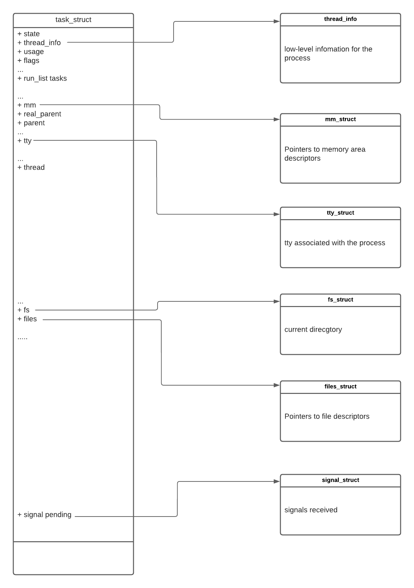
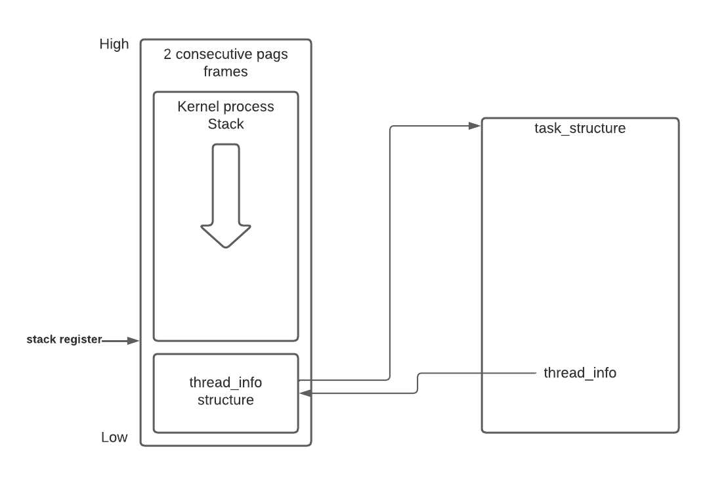

# Linux Process Descriptor based on kernel 2.6 X86

The big structure--a task_struct, contain all the informatnion related to a single process.

## The resources owned by the task_struct



## Process state

- TASK_RUNNING

The process is either executing on a CPU or waiting to be executed.
- TASK_INTERRUPTIBLE

The process is suspended (sleeping) until some condition becomes true. Raising
a hardware interrupt, releasing a system resource the process is waiting for, or
delivering a signal are examples of conditions that might wake up the process
(put its state back to TASK_RUNNING).

- TASK_UNINTERRUPTIBLE

Like TASK_INTERRUPTIBLE, except that delivering a signal to the sleeping process
leaves its state unchanged. This process state is seldom used. It is valuable, however, under certain specific conditions in which a process must wait until a given
event occurs without being interrupted. For instance, this state may be used when a process opens a device file and the corresponding device driver starts
probing for a corresponding hardware device. The device driver must not be interrupted until the probing is complete, or the hardware device could be left in
an unpredictable state.

- TASK_STOPPED

Process execution has been stopped; the process enters this state after receiving a
SIGSTOP, SIGTSTP, SIGTTIN, or SIGTTOU signal.

- TASK_TRACED

Process execution has been stopped by a debugger. When a process is being monitored by another (such as when a debugger executes a ptrace() system call to
monitor a test program), each signal may put the process in the TASK_TRACED state.

- EXIT_ZOMBIE

Process execution is terminated, but the parent process has not yet issued a
wait4() or waitpid() system call to return information about the dead process.*
Before the wait( )-like call is issued, the kernel cannot discard the data contained in the dead process descriptor because the parent might need it.

- EXIT_DEAD

The final state: the process is being removed by the system because the parent
process has just issued a wait4() or waitpid() system call for it. Changing its
state from EXIT_ZOMBIE to EXIT_DEAD avoids race conditions due to other threads
of execution that execute wait()-like calls on the same process

## Process ID

<---> measn one-to-one match

process,even light weight process<--->task_struct<---->pointer to task_struct<--->Process ID(PID)

However, the POSIX 1003.1c standard states that all threads of a multithreaded application must have the same PID.To comply with this standard, Linux makes use of thread groups. The identifier
shared by the threads is the PID of the thread group leader, that is, the PID of the first lightweight process in the group; it is stored in the **tgid** field of the process descriptors.The **getpid()** system call returns the value of **tgid** relative to the current process instead of the value of **pid**, so all the threads of a multithreaded application share the same identifier. Most processes belong to a thread group consisting of a single member; as thread group leaders, they have the tgid field equal to the pid field, thus the getpid() system call works as usual for this kind of process.


## why the max PID is 32768 (4K*8) in 32-bit architectures
When recycling PID numbers, the kernel must manage a **pidmap_array** bitmap that
denotes which are the PIDs currently assigned and which are the free ones. Because a
page frame contains 32,768 bits, in 32-bit architectures the pidmap_array bitmap is
stored in a single page. In 64-bit architectures, however, additional pages can be
added to the bitmap when the kernel assigns a PID number too large for the current
bitmap size. These pages are never released. In 64-bit architectures, the system administrator can enlarge the maximum PID number up to
4,194,303.The system administrator may reduce this limit by writing a smaller value into the /proc/sys/kernel/pid_max file.


## Kernal process stack and thread_info

For each process, Linux packs two different data structures in a single per-process memory area: a small data structure linked to the process descriptor, namely the thread_info structure, and the Kernel Mode process stack. The length of this memory area is usually 8,192 bytes (two page frames).
For reasons of efficiency the kernel stores the 8-KB memory area in two consecutive page frames with the first page frame aligned to a multiple of 213; this may turn out
to be a problem when little dynamic memory is available, because the free memory may become highly fragmented. Therefore, in the 80×86 architecture the kernel can be configured at
compilation time so that the memory area including stack and thread_info structure spans a single page frame (4,096 bytes).Because kernel control paths
make little use of the stack, only a few thousand bytes of kernel stack are required. Therefore, 8 KB is ample space for the stack and the thread_info structure. However, when stack and thread_info structure are contained in a single page frame, the kernel uses a few additional stacks to avoid the overflows caused by deeply nested interrupts and exceptions



Right after switching from User Mode to Kernel Mode, the kernel stack of a process is always empty, and therefore the stack pointer register points to the byte immediately following the stack.

To get the pointer to thread_info of current task

``` C
movl $0xffffe000,%ecx /* or 0xfffff000 for 4KB stacks */
andl %esp,%ecx
movl %ecx,p
```

To get the pointer to current task_struct 

``` C
movl $0xffffe000,%ecx /* or 0xfffff000 for 4KB stacks */
andl %esp,%ecx
movl (%ecx),p
```

which is essentially equivalent to current_thread_info()->task


The **current**  macro often appears in kernel code as a prefix to fields of the process
descriptor. For example, current->pid returns the process ID of the process cur-
rently running on the CPU.


On multiprocessor systems, it was necessary to define current as an array—one element for each available CPU.

## Move thread_info out of kernel process stack in AMR64

[arm64: move thread_info off of the task stack](https://lwn.net/Articles/700782/)


Building atop of Andy's work on x86 and generic code, these patches move
arm64's thread_info off of the stack and into task_struct. This protects
thread_info from corruption in the face of stack overflow, and serves as
a step towards fully robust stack overflow handling will be addressed by
subsequent patches.

In contrast to x86, we can't place some critical data such as
preempt_count in percpu variables, and we must store these in some
per-task location. This, compounded with the way headers are organised
conspires to require us to still define our own thread_info. I
understand that the longer term plan is to kill off thread_info
entirely, hence I'm sending this as an RFC so we can figure out if/how
we can achieve that.

These patches are based on Andy's x86/vmap_stack branch [1,2], and I've
pushed a copy to me arm64/ti-stack-split branch [3,4]. The result of
these patches boots happily on platforms within reach of my desk, but
has not seen much stressing so far.

## Doubly linked list
**list_head** is circular double linked list.
The Linux kernel 2.6 sports another kind of doubly linked list, which mainly differs
from a list_head list because it is not circular; it is mainly used for hash tables,
where space is important, and finding the the last element in constant time is not.
The list head is stored in an **hlist_head** data structure, which is simply a pointer to
the first element in the list (NULL if the list is empty). Each element is represented by
an hlist_node data structure, which includes a pointer next to the next element, and
a pointer pprev to the next field of the previous element. Because the list is not circu-
lar, the pprev field of the first element and the next field of the last element are set to
NULL.

## Process list

init_task(process 0 or swapper) is header of all process list


## The list of TASK_RUNNING processes

Each task_struct descriptor includes a run_list field of type list_head. If the process priority is equal
to k (a value ranging between 0 and 139), the run_list field links the process descrip-
tor into the list of runnable processes having priority k. Furthermore, on a multipro-
cessor system, each CPU has its own runqueue, that is, its own set of lists of
processes. This is a classic example of making a data structures more complex to
improve performance: to make scheduler operations more efficient, the runqueue list
has been split into 140 different lists!
The enqueue_task(p,array) function inserts a process descriptor into a runqueue list;
its code is essentially equivalent to:
```C
list_add_tail(&p->run_list, &array->queue[p->prio]);
__set_bit(p->prio, array->bitmap);
array->nr_active++;
p->array = array;
```
The prio field of the process descriptor stores the dynamic priority of the process,
while the array field is a pointer to the prio_array_t data structure of its current run-
queue. Similarly, the dequeue_task(p,array) function removes a process descriptor
from a runqueue list.

## Relationship Among Process

- real_parent

Points to the process descriptor of the process that created P or to the descriptor of process 1
(init) if the parent process no longer exists. (Therefore, when a user starts a background process
and exits the shell, the background process becomes the child of init.)
- parent

Points to the current parent of P (this is the process that must be signaled when the child process
terminates); its value usually coincides with that of real_parent. It may occasionally differ,
such as when another process issues a ptrace( ) system call requesting that it be allowed to
monitor P.

- children

The head of the list containing all children created by P.

- sibling 

The pointers to the next and previous elements in the list of the sibling processes, those that
have the same parent as P.

Furthermore, there exist other relationships among processes: a process can be a
leader of a process group or of a login session,, it can be a leader of a thread group;and it can also trace the execution of other processes

- group_leader 
Process descriptor pointer of the group leader of P
- signal->pgrp
PID of the group leader of P
- tgid
PID of the thread group leader of P
- signal->session
PID of the login session leader of P
- ptrace_children
The head of a list containing all children of P being traced by a debugger
- ptrace_list
The pointers to the next and previous elements in the real parent’s list of traced processes
(used when P is being traced)

## how to derive a pointer to task_struct from respective PID

Efficiency is important because many system calls such as kill( ) use the PID to denote the affected process.Scanning the process list sequentially and checking the pid fields of the process
descriptors is feasible but rather inefficient.
To speed up the search, four hash tables have been introduced. Why multiple hash tables? Simply because the process descriptor includes fields that represent different types of PID,and
each type of PID requires its own hash table.

| Hash table type |  Field name | Description|
|    :----:       |  :----:     |  :----:    |
|    PIDTYPE_PID  |  pid        |  PID of the process   |
|  PIDTYPE_TGID   |  tgid       |  PID of thread group leader process    |
|   PIDTYPE_PGID  |  pgrp       |  PID of the group leader process   |
|   PIDTYPE_SID   |  session    |  PID of the session leader process  |

The four hash tables are dynamically allocated during the kernel initialization phase, and their addresses are stored in the  **pid_hash** array.The size of a single hash table
depends on the amount of available RAM; for example, for systems having 512 MB of RAM, each hash table is stored in four page frames and includes 2,048 entries.
The PID is transformed into a table index using the pid_hashfn macro, which
expands to:
```C
#define pid_hashfn(x) hash_long((unsigned long) x, pidhash_shift)
```

The pidhash_shift variable stores the length in bits of a table index (11, in our exam-
ple). The hash_long() function is used by many hash functions; on a 32-bit architec-
ture it is essentially equivalent to:
```C
unsigned long hash_long(unsigned long val, unsigned int bits)
{
    unsigned long hash = val * 0x9e370001UL;
    return hash >> (32 - bits);
}
```
Because in our example pidhash_shift is equal to 11, pid_hashfn yields values rang-
ing between 0 and 211 − 1 = 2047.

As every basic computer science course explains, a hash function does not always
ensure a one-to-one correspondence between PIDs and table indexes. Two different
PIDs that hash into the same table index are said to be colliding. Linux uses chaining to handle colliding PIDs; each table entry is the head of a dou-
bly linked list of colliding process descriptors.Hashing with chaining is preferable to a linear transformation from PIDs to table
indexes because at any given instance, the number of processes in the system is usu-
ally far below 32,768 (the maximum number of allowed PIDs). It would be a waste
of storage to define a table consisting of 32,768 entries, if, at any given instance,
most such entries are unused.

## Wait queues

Processes in a TASK_INTERRUPTIBLE or TASK_UNINTERRUPTIBLE state are subdivided
into many classes, each of which corresponds to a specific event. In this case, the
process state does not provide enough information to retrieve the process
quickly, so it is necessary to introduce additional lists of processes.These are
called wait queues.

By the way, Processes in a TASK_STOPPED, EXIT_ZOMBIE, or EXIT_DEAD state are not linked in
specific lists. There is no need to group processes in any of these three states,
because stopped, zombie, and dead processes are accessed only via PID or via
linked lists of the child processes for a particular parent.

```C
struct __wait_queue_head {
    spinlock_t lock;
    struct list_head task_list;
};
typedef struct __wait_queue_head wait_queue_head_t;
```

Because wait queues are modified by interrupt handlers as well as by major kernel
functions, the doubly linked lists must be protected from concurrent accesses, which
could induce unpredictable results. Synchronization is achieved by
the lock spin lock in the wait queue head. The task_list field is the head of the list
of waiting processes.

Elements of a wait queue list are of type wait_queue_t:
```C
struct __wait_queue {
    unsigned int flags;
    struct task_struct * task;
    wait_queue_func_t func;
    struct list_head task_list;
};
typedef struct __wait_queue wait_queue_t;
```

However, it is not always convenient to wake up all sleeping processes in a wait
queue. For instance, if two or more processes are waiting for exclusive access to
some resource to be released, it makes sense to wake up just one process in the wait
queue. This process takes the resource, while the other processes continue to sleep.
(This avoids a problem known as the “thundering herd,” with which multiple pro-
cesses are wakened only to race for a resource that can be accessed by one of them,
with the result that remaining processes must once more be put back to sleep.)
Thus, there are two kinds of sleeping processes: exclusive processes (denoted by the
value 1 in the flags field of the corresponding wait queue element) are selectively
woken up by the kernel, while nonexclusive processes (denoted by the value 0 in the
flags field) are always woken up by the kernel when the event occurs. A process
waiting for a resource that can be granted to just one process at a time is a typical
exclusive process. Processes waiting for an event that may concern any of them are
nonexclusive. Consider, for instance, a group of processes that are waiting for the
termination of a group of disk block transfers: as soon as the transfers complete, all
waiting processes must be woken up. As we’ll see next, the func field of a wait queue
element is used to specify how the processes sleeping in the wait queue should be
woken up.

## Process Switch

A process switch may occur at just one well-defined point: the schedule() function,Essentially, every process switch consists of two steps:
1. Switching the Page Global Directory to install a new address space; 


2. Switching the Kernel Mode stack and the hardware context, which provides all
the information needed by the kernel to execute the new process, including the
CPU registers.

The second step of the process switch is performed by the switch_to macro. It is one
of the most hardware-dependent routines of the kernel, and it takes some effort to
understand what it does.


## clone, fork() and vfork()

Traditional Unix systems treat all processes in the same way: resources owned by the
parent process are duplicated in the child process. This approach makes process cre-
ation very slow and inefficient, because it requires copying the entire address space
of the parent process. The child process rarely needs to read or modify all the
resources inherited from the parent; in many cases, it issues an immediate execve( )
and wipes out the address space that was so carefully copied.

Modern Unix kernels solve this problem by introducing three different mechanisms:

- The Copy On Write technique allows both the parent and the child to read the
same physical pages. Whenever either one tries to write on a physical page, the
kernel copies its contents into a new physical page that is assigned to the writing
process. 

- Lightweight processes allow both the parent and the child to share many per-
process kernel data structures, such as the paging tables (and therefore the entire
User Mode address space), the open file tables, and the signal dispositions.

- The vfork( ) system call creates a process that shares the memory address space
of its parent. To prevent the parent from overwriting data needed by the child,
the parent’s execution is blocked until the child exits or executes a new pro-
gram. 


### clone
``` C
clone (
    fn   //Specifies a function to be executed by the new process; when the function returns, the child terminates. The function returns an integer, which represents the exit code for the child process.
    arg
    flags //Miscellaneous information. The low byte specifies the signal number to be sent to the parent process when the child terminates; the SIGCHLD signal is generally selected. The remaining three bytes encode a group of clone flags,
    child_stack //Specifies the User Mode stack pointer to be assigned to the esp register of the child process. The invoking process (the parent) should always allocate a new stack for the child.
    tls //Specifies the address of a data structure that defines a Thread Local Storage segment for the new lightweight process.Meaningful only if the CLONE_SETTLS flag is set
    ptid //Specifies the address of a User Mode variable of the parent process that will hold the PID of the new lightweight process. Meaningful only if the CLONE_PARENT_ SETTID flag is set.
    ctid //Specifies the address of a User Mode variable of the new lightweight process that will hold the PID of such process. Meaningful only if the CLONE_CHILD_SETTID flag is set.
)
```
Clone flags

- CLONE_VM Shares the memory descriptor and all Page Tables (see Chapter 9).
- CLONE_FS Shares the table that identifies the root directory and the current working directory, as
well as the value of the bitmask used to mask the initial file permissions of a new file (the so-called file umask).
- CLONE_FILES Shares the table that identifies the open files
- CLONE_SIGHAND Shares the tables that identify the signal handlers and the blocked and pending signals If this flag is true, the CLONE_VM flag must also be set.
- CLONE_PTRACE If traced, the parent wants the child to be traced too. Furthermore, the debugger may want to trace the child on its own; in this case, the kernel forces the flag to 1.
- CLONE_VFORK Set when the system call issued is a vfork( ) (see later in this section).
- CLONE_PARENT Sets the parent of the child (parent and real_parent fields in the process descriptor) to the parent of the calling process.
- CLONE_THREAD Inserts the child into the same thread group of the parent, and forces the child to share the signal descriptor of the parent. The child’s tgid and group_leader fields are set accordingly. If this flag is true, the CLONE_SIGHAND flag must also be set.
- CLONE_NEWNS Set if the clone needs its own namespace, that is, its own view of the mounted filesys- tems ; it is not possible to specify both CLONE_NEWNS and CLONE_FS.
- CLONE_SYSVSEM Shares the System V IPC undoable semaphore operations
- CLONE_SETTLS Creates a new Thread Local Storage (TLS) segment for the lightweight process; the segment is described in the structure pointed to by the tls parameter.
- CLONE_PARENT_SETTID Writes the PID of the child into the User Mode variable of the parent pointed to by the ptid parameter.
- CLONE_CHILD_CLEARTID When set, the kernel sets up a mechanism to be triggered when the child process will exit or when it will start executing a new program. In these cases, the kernel will clear
the User Mode variable pointed to by the ctid parameter and will awaken any process waiting for this event.
- CLONE_DETACHED A legacy flag ignored by the kernel.
- CLONE_UNTRACED Set by the kernel to override the value of the CLONE_PTRACE flag (used for disabling
tracing of kernel threads; see the section “Kernel Threads” later in this chapter).
- CLONE_CHILD_SETTID Writes the PID of the child into the User Mode variable of the child pointed to by the
ctid parameter.
- CLONE_STOPPED Forces the child to start in the TASK_STOPPED state.


The vfork( ) system call is implemented by Linux as a clone( ) system call whose flags parameter specifies both a SIGCHLD signal
and the flags CLONE_VM and CLONE_VFORK, and whose child_stack parameter is equal to the current parent stack pointer.

The traditional fork( ) system call is implemented by Linux as a clone( ) system call
whose flags parameter specifies both a SIGCHLD signal and all the clone flags cleared,
and whose child_stack parameter is the current parent stack pointer. Therefore, the
parent and child temporarily share the same User Mode stack. But thanks to the
Copy On Write mechanism, they usually get separate copies of the User Mode stack
as soon as one tries to change the stack.