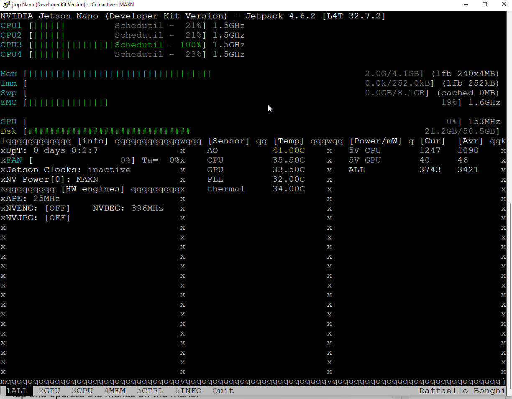

# Running OpenCV on Nvidia Jetson Nano with HW acceleration

 

## 1.Table of Contents

<!-- @import "[TOC]" {cmd="toc" depthFrom=1 depthTo=6 orderedList=false} -->

<!-- code_chunk_output -->

- [Running OpenCV on Nvidia Jetson Nano with HW acceleration](#running-opencv-on-nvidia-jetson-nano-with-hw-acceleration)
  - [1.Table of Contents](#1table-of-contents)
  - [2. Environment and Version](#2-environment-and-version)
  - [3. Prerequisite](#3-prerequisite)
    - [3.1. Compiling OpenCV with CUDA supported on Jetson Nano](#31-compiling-opencv-with-cuda-supported-on-jetson-nano)
      - [3.1.1. Enlarge memory swap](#311-enlarge-memory-swap)
      - [3.1.2. Install all Dependencies](#312-install-all-dependencies)
        - [3.1.2.1. Want OpenCV to support Qt5?](#3121-want-opencv-to-support-qt5)
      - [3.1.3. Download openCV4.6.0](#313-download-opencv460)
      - [3.1.4. Building openCV4.6.0](#314-building-opencv460)
      - [3.1.5. Check openCV installation](#315-check-opencv-installation)
      - [3.1.6. Roll back the swap space](#316-roll-back-the-swap-space)
    - [3.2. One-stop solution shell script to build openCV](#32-one-stop-solution-shell-script-to-build-opencv)
    - [3.3. Download 4K MP4 Video example](#33-download-4k-mp4-video-example)
    - [3.4. Install jetson-stats](#34-install-jetson-stats)
  - [4. Play video with or without hardware accelerate](#4-play-video-with-or-without-hardware-accelerate)
  - [5. Reference](#5-reference)

<!-- /code_chunk_output -->

## 2. Environment and Version

| Component Name  | Version  | Description |
| :------------: |:---------------:| :-----:|
| JetPack sdk  | 4.6.2 |  |
| Cuda Toolkit     | 10.2        |   |
| GNU gcc | 7.5.0        |    |
| Linux Kernel     | 4.9        |  |
| OpenCV | 4.6.0        |    |

## 3. Prerequisite

### 3.1. Compiling OpenCV with CUDA supported on Jetson Nano

You might have already a version pre-installed OpenCV, however, the pre-installed one has no CUDA support. So you has to rebuild OpenCV with CUDA supported.

Before you are ready to install OpenCV 4.6.0 on your Jetson Nano, you can have a look at the page [Overclocking Jetson Nano CPU to 2 GHZ and GPU to 1 GHZ](https://qengineering.eu/overclocking-the-jetson-nano.html) if you would like overclocking.

#### 3.1.1. Enlarge memory swap

It needs more than 4Gbytes of RAM and the 2Gbytes of swap space to build the full OpenCV package. We will install dphys-swapfile to get the additional space from SD card, and we will roll back swap sapce to sd card after compilation.
`$ sudo apt-get update`
`$ sudo apt-get upgrade`
`$ sudo apt-get install vim`
`$ sudo apt-get install dphys-swapfile`

To build OpenCV 4.6.0, you need to increase the swap space up to 6144MBytes.Otherwise the compilation will crash without hint, especially when using `make -j4`.
But some unkonwn stumbling block always appears on the path to success. You will possibly fail to run dphys-swapfile serice on Nano's Ubuntu18.04 because there are some errors while /bin/sh is doing arithmatic calcaltion. So run `$ sudo vim /sbin/dphys-swapfile` to change as below:

``` shell
$ sudo diff /sbin/dphys-swapfile.origin /sbin/dphys-swapfile
1c1
< #! /bin/sh
---
> #! /bin/bash
8c8,10
<
---
> # the original script is running the /bin/sh. However on re-use of the /sbin/dphys-swapfile the /bin/sh
> # arithmatic calculations failed. Then /bin/bash is used for replacing with /bin/sh,moreover, added "let"
> # in front of all the lines with arithmatic calculations
30c32,33
< CONF_MAXSWAP=2048
---
> CONF_MAXSWAP=6144
>
71c74
<       MEMSIZE="`echo "${MEMTOTAL} 1024 / 10 + p q" | dc`"
---
>       let MEMSIZE="`echo "${MEMTOTAL} 1024 / 10 + p q" | dc`"
73c76
<       CONF_SWAPSIZE="`echo "${MEMSIZE} ${CONF_SWAPFACTOR} * p q" | dc`"
---
>       let CONF_SWAPSIZE="`echo "${MEMSIZE} ${CONF_SWAPFACTOR} * p q" | dc`"
102c105
<       SWAPBYTES="`echo "${CONF_SWAPSIZE} 1048576 * p q" | dc`"
---
>       let SWAPBYTES="`echo "${CONF_SWAPSIZE} 1048576 * p q" | dc`"

```

By the way, you don't worry about /etc/dphys-swapfile if you don't want more customized configuration.

After editing /sbin/dphys-swapfile. reboot nano device by  `$ sudo reboot`

after reboot, run the command `$ free -m` to check swap space, the total size of Swap should be about "8122" if you sucessfully change *CONF_MAXSWAP=6144*

``` shell
$ free -m
              total        used        free      shared  buff/cache   available
Mem:           3956         597        2808          19         549        3188
Swap:          8122           0        8122

```

#### 3.1.2. Install all Dependencies

To install all dependencies, make sure there are enough free space on your SD card. All these package will take up about 800MBtes.

``` shell
# reveal the CUDA location
$ sudo sh -c "echo '/usr/local/cuda/lib64' >> /etc/ld.so.conf.d/nvidia-tegra.conf"
$ sudo ldconfig
# third-party libraries
$ sudo apt-get install build-essential cmake git unzip pkg-config zlib1g-dev
$ sudo apt-get install libjpeg-dev libjpeg8-dev libjpeg-turbo8-dev
$ sudo apt-get install libpng-dev libtiff-dev libglew-dev
$ sudo apt-get install libavcodec-dev libavformat-dev libswscale-dev
$ sudo apt-get install libgtk2.0-dev libgtk-3-dev libcanberra-gtk*
$ sudo apt-get install python-dev python-numpy python-pip
$ sudo apt-get install python3-dev python3-numpy python3-pip
$ sudo apt-get install libxvidcore-dev libx264-dev libgtk-3-dev
$ sudo apt-get install libtbb2 libtbb-dev libdc1394-22-dev libxine2-dev
$ sudo apt-get install gstreamer1.0-tools libgstreamer-plugins-base1.0-dev
$ sudo apt-get install libgstreamer-plugins-good1.0-dev
$ sudo apt-get install libv4l-dev v4l-utils v4l2ucp qv4l2
$ sudo apt-get install libtesseract-dev libxine2-dev libpostproc-dev
$ sudo apt-get install libavresample-dev libvorbis-dev
$ sudo apt-get install libfaac-dev libmp3lame-dev libtheora-dev
$ sudo apt-get install libopencore-amrnb-dev libopencore-amrwb-dev
$ sudo apt-get install libopenblas-dev libatlas-base-dev libblas-dev
$ sudo apt-get install liblapack-dev liblapacke-dev libeigen3-dev gfortran
$ sudo apt-get install libhdf5-dev libprotobuf-dev protobuf-compiler
$ sudo apt-get install libgoogle-glog-dev libgflags-dev
```

##### 3.1.2.1. Want OpenCV to support Qt5?

OpenCV is using Qt5 to build GUI windows, but it isn't  mandatory for openCV. BTW, OpenCV with QT5 will slow down a bit its performence. So it is up to your purpose when you make a decision of whether using Qt or not.

if you want QT5 support, then

``` shell
sudo apt-get install qt5-default
```

When you are compiling openCV, enable *-DWITH_QT=ON*

#### 3.1.3. Download openCV4.6.0

``` shell
cd ~/workspace
wget -O opencv.zip https://github.com/opencv/opencv/archive/4.6.0.zip
wget -O opencv_contrib.zip https://github.com/opencv/opencv_contrib/archive/4.6.0.zip

unzip opencv.zip
unzip opencv_contrib.zip

mv opencv-4.6.0 opencv
mv opencv_contrib-4.6.0 opencv_contrib

rm opencv.zip
rm opencv_contrib.zip
```

#### 3.1.4. Building openCV4.6.0

``` shell
$ cd ~/opencv-4.6.0
$ mkdir build
$ cd build

$ cmake -D CMAKE_BUILD_TYPE=RELEASE \
-D CMAKE_INSTALL_PREFIX=/usr \
-D OPENCV_EXTRA_MODULES_PATH=~/workspace/opencv_contrib-4.6.0/modules \
-D EIGEN_INCLUDE_PATH=/usr/include/eigen3 \
-D WITH_OPENCL=OFF \
-D WITH_CUDA=ON \
-D CUDA_ARCH_BIN=5.3 \
-D CUDA_ARCH_PTX="" \
-D WITH_CUDNN=ON \
-D WITH_CUBLAS=ON \
-D ENABLE_FAST_MATH=ON \
-D CUDA_FAST_MATH=ON \
-D OPENCV_DNN_CUDA=ON \
-D ENABLE_NEON=ON \
-D WITH_QT=ON \
-D WITH_OPENMP=ON \
-D BUILD_TIFF=ON \
-D WITH_FFMPEG=ON \
-D WITH_GSTREAMER=ON \
-D WITH_TBB=ON \
-D BUILD_TBB=ON \
-D BUILD_TESTS=OFF \
-D WITH_EIGEN=ON \
-D WITH_V4L=ON \
-D WITH_LIBV4L=ON \
-D OPENCV_ENABLE_NONFREE=ON \
-D INSTALL_C_EXAMPLES=OFF \
-D INSTALL_PYTHON_EXAMPLES=OFF \
-D PYTHON3_PACKAGES_PATH=/usr/lib/python3/dist-packages \
-D OPENCV_GENERATE_PKGCONFIG=ON \
-D BUILD_EXAMPLES=OFF ..

$ make -j4

$ sudo rm -r /usr/include/opencv4/opencv2
$ sudo make install
$ sudo ldconfig

$ make clean
$ sudo apt-get update

```

#### 3.1.5. Check openCV installation

- run python3 and import cv2 to check
``` shell
$ python3
Python 3.6.9 (default, Jun 29 2022, 11:45:57)
[GCC 8.4.0] on linux
Type "help", "copyright", "credits" or "license" for more information.
>>> import cv2
>>> cv2.__version__
'4.6.0'
>>> exit()
```
- run jtop, check *OpenCV* itme on *6INFO* tab 
Refer to [3.4. Install jetson-stats](#34-install-jetson-stats) to install jetson-stats packages


#### 3.1.6. Roll back the swap space

After installation of openCV, Change *CONF_MAXSWAP* in /sbin/dphys-swapfile back to 2048, then reboot

### 3.2. One-stop solution shell script to build openCV

[click here](../../../code/script/install-opencv-4.6.0.sh) to look at install shell script

### 3.3. Download 4K MP4 Video example

Make sure you download 4K video with H.264 codec, save mp4 video as "demo.mp4"
[click here](https://4kmedia.org/spacex-launches-uhd-4k-demo/) to download 4k video

### 3.4. Install jetson-stats

`sudo apt-get install python3-pip`
`sudo -H pip3 install -U jetson-stats`

## 4. Play video with or without hardware accelerate

To get all python script, please [click here](../../../code/script/play-video-cv.py) to find play video python script

- As default, play video with hardware acceleration and resize frame in gstreamer
`python3 play-video-cv.py`
- play video without hardware acceleration
`python3 play-video-cv.py no-hw`
OR
`python3 play-video-cv.py no-hardware-accelerate`

- play video with hardware acceleartion but resize frame in software 
`python3 play-video-cv.py hw`
OR
`python3 play-video-cv.py hardware-accelerate`

Then, you can check jtop information


## 5. Reference
- [1] [How to Cross Compile OpenCV and MXNET for NVIDIA Jetson (AArch64 CUDA)](https://medium.com/trueface-ai/how-to-cross-compile-opencv-and-mxnet-for-nvidia-jetson-aarch64-cuda-99d467958bce)
- [2] [Install OpenCV 4.5 on Jetson Nano](https://qengineering.eu/install-opencv-4.5-on-jetson-nano.html)
- [3] [CUDA Toolkit Documentation](https://docs.nvidia.com/cuda/cuda-c-programming-guide/index.html#async_prog_model_intro)
- [4] [Nvidia Jetson Nano using HW decoder to accelerate decoding 4K video](https://young-eager-mind.medium.com/nvidia-jetson-nano-using-hw-decoder-to-accelerate-decoding-4k-video-ce786875634f)